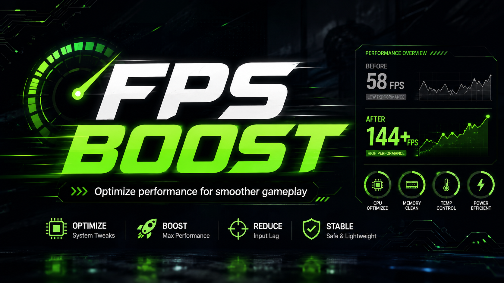

# Extreme-FPS-Boost

<div align="center">



<br>

# FPS BOOST

**A lightweight Windows optimization utility designed to improve FPS, reduce input latency, and provide smoother gameplay.**

<br>

[](https://www.microsoft.com/windows)
[](#-system-requirements)
[](https://github.com/YOUR_USERNAME/YOUR_REPOSITORY/releases/latest)
[](https://github.com/YOUR_USERNAME/YOUR_REPOSITORY/releases)
[](https://github.com/YOUR_USERNAME/YOUR_REPOSITORY/stargazers)

<br>

[**Download Latest Release**](https://github.com/YOUR_USERNAME/YOUR_REPOSITORY/releases/latest) ·
[Features](#-features) ·
[Installation](#-installation) ·
[Usage](#-usage) ·
[FAQ](#-frequently-asked-questions)

</div>

---

## 🚀 Overview

**FPS BOOST** is a Windows performance optimization utility created to improve system responsiveness and gaming performance.

It applies a collection of performance-focused settings that can help reduce unnecessary background activity, improve frame-time stability, optimize resource usage, and reduce input latency.

The utility is designed to be simple, lightweight, and easy to use — no complicated manual configuration is required.

> [!NOTE]
> Performance improvements depend on your hardware, Windows configuration, graphics settings, installed software, and background applications.

---

## ⚡ Features

| Feature                         | Description                                                 |
| ------------------------------- | ----------------------------------------------------------- |
| **FPS Optimization Presets**    | Ready-to-use profiles for different hardware configurations |
| **CPU Scheduling Improvements** | Adjusts performance-related processor scheduling settings   |
| **Memory Optimization**         | Helps reduce unnecessary memory usage and background load   |
| **Input Latency Reduction**     | Applies settings intended to improve system responsiveness  |
| **Frame-Time Optimization**     | Helps provide smoother and more consistent frame delivery   |
| **Graphics Configuration**      | Applies performance-focused Windows graphics settings       |
| **Startup Optimization**        | Reduces unnecessary processes that may affect game startup  |
| **Windows Performance Tweaks**  | Configures selected system settings for better performance  |
| **Restore Support**             | Allows supported settings to be returned to their defaults  |
| **One-Click Optimization**      | Apply the selected optimization profile with minimal setup  |
| **Lightweight Utility**         | Designed to use minimal storage and system resources        |

---

## 📊 Performance Testing

FPS BOOST is intended to improve overall system responsiveness, frame-time consistency, and gaming performance.

Actual FPS gains will vary between systems. For accurate results, benchmark the same scene using identical graphics settings before and after optimization.

### Test System

| Component            | Specification              |
| -------------------- | -------------------------- |
| **CPU**              | Add your processor         |
| **GPU**              | Add your graphics card     |
| **Memory**           | Add your RAM configuration |
| **Operating System** | Windows 10 or Windows 11   |
| **Resolution**       | Add test resolution        |
| **Graphics Preset**  | Add test preset            |

### Benchmark Results

| Metric                | Before Optimization | After Optimization |
| --------------------- | ------------------: | -----------------: |
| **Average FPS**       |            `XX FPS` |           `XX FPS` |
| **1% Low FPS**        |            `XX FPS` |           `XX FPS` |
| **Frame Time**        |             `XX ms` |            `XX ms` |
| **Game Startup Time** |        `XX seconds` |       `XX seconds` |

> [!IMPORTANT]
> Replace the values above with results measured on your own hardware. Avoid publishing estimated or unverified performance gains.

Results may vary depending on:

* Hardware configuration
* Windows version and system settings
* Graphics driver version
* Graphics quality and resolution
* Game or application version
* Background processes
* Thermal and power limits

---

## 🖥️ System Requirements

| Requirement          | Minimum                               |
| -------------------- | ------------------------------------- |
| **Operating System** | Windows 10 or Windows 11              |
| **Architecture**     | 64-bit                                |
| **Memory**           | 4 GB RAM                              |
| **Storage**          | 200 MB available space                |
| **Permissions**      | Administrator privileges              |
| **Connection**       | Required only for downloading updates |

> [!WARNING]
> Create a Windows restore point before applying system-level optimizations. Close running games and important applications before starting.

---

## 📥 Download

Download the newest version from the official GitHub Releases page:

### [⬇️ Download Latest Release](https://github.com/YOUR_USERNAME/YOUR_REPOSITORY/releases/latest)

Only download FPS BOOST from this repository or its official release page.

---

## 📖 Installation

1. Open the [latest release page](https://github.com/YOUR_USERNAME/YOUR_REPOSITORY/releases/latest).
2. Download the newest archive from the **Assets** section.
3. Extract the downloaded archive to a separate folder.
4. Run the FPS BOOST executable as **Administrator**.
5. Select the optimization profile suitable for your system.
6. Create a restore point when prompted.
7. Apply the selected optimizations.
8. Restart Windows to ensure all changes take effect.

---

## 🎮 Usage

1. Launch FPS BOOST as **Administrator**.
2. Review the available optimization profiles.
3. Select the profile you want to use.
4. Click **Apply Optimization**.
5. Wait until the process is complete.
6. Restart your computer.
7. Launch your game or application and test the results.

For accurate performance comparisons, use the same:

* Resolution
* Graphics preset
* Test location or benchmark
* Driver version
* Background applications
* Power plan

---

## 🔄 Restoring Default Settings

To restore the supported settings:

1. Launch FPS BOOST as **Administrator**.
2. Open the **Restore** section.
3. Select **Restore Default Settings**.
4. Confirm the operation.
5. Restart your computer.

You can also use the Windows restore point created before optimization.

---

## ❓ Frequently Asked Questions

<details>
<summary><strong>Will FPS BOOST increase my FPS?</strong></summary>

<br>

Performance gains depend on your hardware and current Windows configuration.

Systems with unnecessary background processes, inefficient power settings, or poorly configured performance options may experience a more noticeable improvement.

FPS BOOST cannot compensate for hardware limitations or guarantee a specific FPS increase.

</details>

<details>
<summary><strong>Is FPS BOOST safe to use?</strong></summary>

<br>

FPS BOOST is designed to apply performance-related configuration changes.

You should still create a Windows restore point before applying system-level settings and download the utility only from the official repository.

</details>

<details>
<summary><strong>Does it support Windows 11?</strong></summary>

<br>

Yes. FPS BOOST is intended for supported 64-bit versions of Windows 10 and Windows 11.

</details>

<details>
<summary><strong>Can I restore the original settings?</strong></summary>

<br>

Yes. Supported changes can be reverted through the restore function or by using a Windows restore point.

</details>

<details>
<summary><strong>Does it work with every game?</strong></summary>

<br>

The utility applies Windows and system-level optimizations rather than game-specific modifications.

The final result depends on the game, graphics engine, hardware configuration, graphics settings, and existing system performance.

</details>

<details>
<summary><strong>Does it modify game files?</strong></summary>

<br>

FPS BOOST is intended to focus on local Windows performance settings and system configuration.

It should not require modification of game executables or protected online game files.

</details>

<details>
<summary><strong>Why do I need administrator privileges?</strong></summary>

<br>

Some Windows performance settings require elevated permissions. Administrator access allows the utility to apply and restore supported system-level changes.

</details>

<details>
<summary><strong>Do I need to restart my computer?</strong></summary>

<br>

A restart is recommended because some system settings do not take effect immediately.

</details>

---

## 🛡️ Safety Recommendations

Before applying optimizations:

* Create a Windows restore point
* Close running games and applications
* Save important documents
* Download only from the official repository
* Do not interrupt the optimization process
* Restart Windows after applying or restoring settings

> [!CAUTION]
> Do not use modified builds distributed by unknown third parties. Unofficial versions may contain unwanted or malicious changes.

---

## 🐛 Issues and Feedback

Found a bug or have a suggestion?

[Open a new issue](https://github.com/YOUR_USERNAME/YOUR_REPOSITORY/issues/new) and include:

* Windows version
* CPU and GPU model
* FPS BOOST version
* Selected optimization profile
* Description of the problem
* Steps needed to reproduce it
* Screenshots or logs, when available

Before creating a new issue, check whether the problem has already been reported.

---

## ⭐ Support the Project

If FPS BOOST helped improve your system performance:

* Leave a **Star** on the repository
* Share the project
* Report bugs
* Suggest improvements
* Follow future releases

<div align="center">

### ⭐ A GitHub Star helps the project grow

[](https://github.com/YOUR_USERNAME/YOUR_REPOSITORY)

</div>

---

## ⚠️ Disclaimer

FPS BOOST is provided for performance optimization and educational purposes.

Performance improvements are not guaranteed. Results depend on the user's hardware, software, Windows configuration, and workload.

The user is responsible for reviewing and applying system modifications. Always create a restore point before changing Windows settings.

This project is not affiliated with Microsoft, NVIDIA, AMD, Intel, or any game developer or publisher.

---

## 🔍 Repository Topics

```text
fps-boost
fps-optimizer
gaming-performance
windows-optimization
windows-11
windows-10
performance-tweaks
input-lag
latency-optimization
frame-time
gaming-utility
system-optimization
pc-optimization
gaming-tools
```

---

<div align="center">

**Built for smoother gameplay and better system performance.**

[Download](https://github.com/YOUR_USERNAME/YOUR_REPOSITORY/releases/latest) ·
[Report a Bug](https://github.com/YOUR_USERNAME/YOUR_REPOSITORY/issues/new) ·
[View Releases](https://github.com/YOUR_USERNAME/YOUR_REPOSITORY/releases)

</div>
